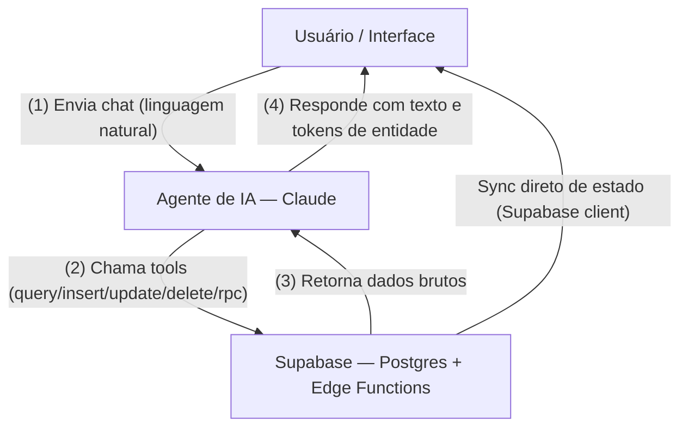
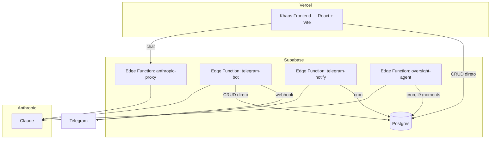

# Khaos

*Ab Khaos ordo.*

Khaos é um sistema pessoal de gestão de projetos, tarefas e tempo, conectado a
uma interface reativa e a uma IA que aprende com os hábitos do usuário ao
longo do tempo.

O nome vem da mitologia grega — o vazio primordial de onde tudo nasce. A
ironia é intencional: um sistema de organização que nasce do caos.

> Na mitologia grega, Khaos é a entidade primordial e a personificação do
> vazio ou abismo. Considerado o primeiro ser a existir na criação, ele não
> representa a desordem caótica moderna, mas sim a imensidão informe e o
> espaço ilimitado de onde tudo surgiu.

## Princípios

- **Consistência** — o banco de dados é seu e permanente. A interface, a IA e
  as ferramentas podem mudar. Os dados nunca.
- **Leveza** — a linguagem do sistema é leve e positiva. Sem "bloqueios", sem
  "deadlines" e outros termos do tipo. Sequências, alvos, momentos.
- **Aprendizado** — o sistema aprende com o usuário ao longo do tempo. Quanto
  tempo se gasta em cada tipo de tarefa, o que se adia, o que se subestima.

## Contexto e propósito



A interface e a IA falam com o **mesmo banco**, pelo mesmo cliente Supabase —
não há um backend intermediário. A interface lê e escreve diretamente via
`@supabase/supabase-js`; a IA age através de um conjunto pequeno de
ferramentas genéricas (`query_rows`, `insert_row`, `update_rows`,
`delete_rows`, `call_rpc`) que também passam pelo Supabase.

## Arquitetura



Não existe backend próprio (a antiga API FastAPI foi descontinuada). O
frontend fala com o Postgres do Supabase diretamente; o único servidor que o
projeto ainda opera é um punhado de **Edge Functions** (Deno), usadas para
esconder chaves e rodar tarefas agendadas — não como camada de API geral.

## Estrutura de arquivos

```
src/
  pages/            rotas principais (Dashboard, Tasks, Projects, Calendar, Assistant, Routines, Tags)
  components/       assistant/ tasks/ projects/ calendar/ timeTracking/ layout/ common/ icons/
  hooks/            useHierarchy, useEvents, useSequence, useTags, useTimeTracking, useRoutines, useMoments, useChatAgent
  lib/
    api/            camada de acesso a dados (Supabase client), uma tabela por arquivo
    chat/           agente de IA: client, tools, prompts, histórico
    supabaseClient.ts
supabase/
  migrations/       histórico de migrações do schema
  functions/        anthropic-proxy, telegram-bot, telegram-notify, oversight-agent, _shared
schema.sql          dump gerado do schema (npm run db:dump)
```

## Documentação

- [Banco de dados](docs/01-database.md)
- [Camada de dados](docs/02-data-layer.md)
- [Integração com IA](docs/03-ai.md)
- [Setup](docs/04-setup.md)
- [Roadmap](docs/05-roadmap.md)
- [Conceitos](docs/06-concepts.md)
