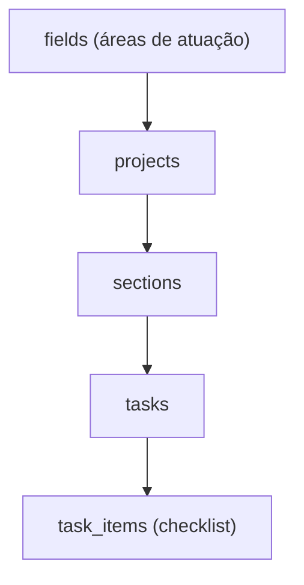
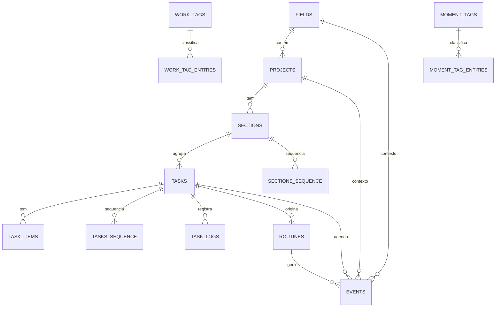

# Khaos — Banco de Dados

## Visão geral

O banco de dados é PostgreSQL hospedado no Supabase (região São Paulo). O
schema completo vive em `schema.sql` na raiz do repo (gerado via
`npm run db:dump`) e as migrações incrementais em `supabase/migrations/`.

O princípio central é a separação entre **dados** e **interface** — o banco é
permanente e independente de qual IA ou ferramenta é usada para acessá-lo.
Não há um backend próprio: o frontend e a IA leem e escrevem diretamente no
Postgres via `@supabase/supabase-js` (ver [Camada de dados](02-data-layer.md)).

Todo IDs primário é `uuid` (`gen_random_uuid()`). RLS está habilitado em toda
tabela, mas com policy `allow all` — é um sistema pessoal de um único dono,
sem modelo multi-tenant.

## Hierarquia principal

## Enums

### `status`

Máquina de estado compartilhada por `projects`, `sections` e `tasks`.

| Valor | Significado |
| --- | --- |
| `planning` | Existe, mas ainda não está pronta para começar |
| `todo` | Pronta para ser feita |
| `in_progress` | Em andamento |
| `in_review` | Aguardando avaliação externa |
| `done` | Concluída |
| `paused` | Pausada temporariamente |
| `cancelled` | Cancelada |
| `waiting` | Bloqueada por outra entidade/etapa da sequência ainda não concluída |

`waiting` é novo em relação à versão original do sistema — ver
[Sequences](#tasks_sequence--sections_sequence) abaixo.

### `priority`

`urgent`, `high`, `medium`, `low`.

### `event_types`

| Valor | Significado |
| --- | --- |
| `scheduled` | Bloco de tempo alocado explicitamente para uma tarefa |
| `fixed` | Compromisso rígido e não-movível (reunião, aula, voo) |
| `routine` | Ocorrência gerada automaticamente a partir de um `routine` template |

### `moment_types`

`created`, `due`, `estimate`, `status`, `started`, `stopped`, `scheduled`,
`target`, `note`, `priority`, `definition`. Ver [Concepts](06-concepts.md)
para o que cada um significa e quando é disparado.

## Tabelas

### `fields`

Áreas de atuação e grandes contextos de vida (ex: Systems, Caligrafia).

| Coluna | Tipo | Descrição |
| --- | --- | --- |
| id | uuid PK | |
| name | text | Nome da área |
| doc_reference | text | Link para documentação externa |
| order | smallint | Ordem de exibição na UI |

### `projects`

Um projeto com começo, meio e fim, dentro de um `field`.

| Coluna | Tipo | Descrição |
| --- | --- | --- |
| id | uuid PK | |
| field_id | FK → fields | |
| name | text | |
| status | status | default `planning` |
| due | timestamptz | Prazo final absoluto (fixado por contrato/cliente) |
| priority | priority | default `medium` |
| target | tstzrange | Janela planejada, arbitrária, para desenvolver o projeto |
| doc_reference | text | |
| deleted_at | timestamptz | Soft delete |

`target` deve terminar antes de `due` quando ambos existem (constraint
`projects_schedule_valid`).

### `sections`

Uma fase, capítulo ou sub-produto dentro de um projeto.

| Coluna | Tipo | Descrição |
| --- | --- | --- |
| id | uuid PK | |
| project_id | FK → projects | |
| name | text | |
| status | status | default `planning` |
| due, priority, target, deleted_at | — | mesmo formato de `projects` |
| is_infinite | boolean | default `false` — seção sem fim natural (uma lista contínua); tarefas `done`/`cancelled` "desbotam" e somem no client em vez de se acumular |

### `tasks`

Uma ação executável pertencente a uma seção.

| Coluna | Tipo | Descrição |
| --- | --- | --- |
| id | uuid PK | |
| section_id | FK → sections | |
| name | text | |
| status | status | default `planning` |
| due, priority, target, deleted_at | — | mesmo formato acima |
| estimate | integer | Minutos estimados |

### `task_items`

Checklist interno de uma tarefa.

| Coluna | Tipo | Descrição |
| --- | --- | --- |
| id | uuid PK | |
| task_id | FK → tasks | |
| description | text | |
| done | boolean | default `false`, vira `true` automaticamente quando a tarefa vira `done` |
| order | smallint | Ordem de exibição (identity/sequence) |

### `tasks_sequence` & `sections_sequence`

Tabelas de adjacência que definem dependência direta entre itens (`X` antes
de `Y`). PK composta `(*_previous, *_next)`.

Ao criar um vínculo, o item "next" entra automaticamente em `waiting`. Quando
o item "previous" é concluído (`done`) ou cancelado/soft-deletado, triggers
(`check_and_unlock_next_tasks` / `check_and_unlock_next_sections`)
reavaliam a cadeia e promovem o próximo item de `waiting` para `todo` assim
que todas as dependências anteriores estiverem resolvidas.

### `events`

Compromissos e blocos de tempo na agenda.

| Coluna | Tipo | Descrição |
| --- | --- | --- |
| id | uuid PK | |
| name | text | |
| event_type | event_types | `scheduled` \| `fixed` \| `routine` |
| duration | tstzrange | Obrigatoriamente limitado (nem aberto no início nem no fim) |
| recurrent | boolean | default `false` |
| task_id, project_id, field_id | FK opcionais | Contexto vinculado |
| routine_id | FK → routines | Se o evento veio de um routine template |
| deleted_at | timestamptz | Soft delete |

### `routines`

Templates para tarefas recorrentes/hábitos.

| Coluna | Tipo | Descrição |
| --- | --- | --- |
| id | uuid PK | |
| name | text | |
| frequency | text | Texto livre ou cron (`"daily"`, `"every monday"`, `"0 9 * * 1-5"`) |
| preferred_time | text | |
| estimate | integer | Minutos por ocorrência |
| constraints | text | Restrições em texto livre |
| active | boolean | default `true` |
| task_id, field_id | FK opcionais | |

### `task_logs`

Registro objetivo de tempo dedicado — substitui a antiga tabela
`time_entries`.

| Coluna | Tipo | Descrição |
| --- | --- | --- |
| id | uuid PK | |
| duration | tstzrange | `[started_at, ended_at)`; aberto (`upper_inf`) enquanto ativo |
| task_id | FK → tasks, opcional | Nulo para trabalho fora da hierarquia (ver `note`/`project_id`) |
| project_id | FK → projects, opcional | Usado quando `task_id` é nulo mas o trabalho pertence a um projeto |
| note | text | Descrição livre quando `task_id` é nulo |
| background | boolean | default `false` — logs `background=true` podem coexistir livremente; só existe **um** log foreground (`background=false`) aberto por vez |

RPCs relacionadas: `stop_active_task()` (encerra o log foreground aberto),
`stop_task_log(p_id)` (encerra um log específico, foreground ou background),
`get_active_task_log()` (retorna todos os logs abertos no momento). A view
`active_task_log` expõe os mesmos logs abertos.

Iniciar um novo log foreground fecha automaticamente o foreground anterior
(trigger `trg_fn_stop_and_start_task_log`); logs background nunca são
afetados por isso.

### `moments`

Linha do tempo narrativa — histórico de mudanças de estado e contexto.

| Coluna | Tipo | Descrição |
| --- | --- | --- |
| id | uuid PK | |
| project_id / section_id / task_id / routine_id | FK, exatamente um preenchido | |
| moment_type | moment_types | default `note` |
| value / previous_value | text | Novo/antigo valor (quando aplicável) |
| moment_note | text | Contexto em linguagem natural |
| authored_by | text | `user` \| `system` \| `assistant` \| `ai_backfill` |
| created_at | timestamptz | |

A maior parte dos moments é gerada automaticamente por triggers em
`projects`/`sections`/`tasks`/`events`/`task_logs` (created, due, estimate,
priority, status, scheduled, started, stopped, target) — ver função
`insert_moment()` e os triggers `trg_moment_*` em `schema.sql`. Só `note`,
`target` e `definition` dependem de alguém (usuário ou IA) escrever
diretamente.

### `oversight_cursor` & `oversight_notes`

Suporte ao **oversight agent** (Edge Function agendada, ver
[Integração com IA](03-ai.md)). `oversight_cursor` é um singleton com o
timestamp do último `moment` já processado; `oversight_notes` guarda
resumos efêmeros gerados por LLM sobre lotes de moments, lidos pelo chat via
a tool `recall_oversight_notes`.

### `telegram_chats`, `telegram_notifications`, `chat_history`

Suporte ao bot do Telegram (ver [Integração com IA](03-ai.md)):
`telegram_chats` guardava histórico por chat antes da unificação;
`chat_history` (linha única, `id = 'khaos'`) é o histórico de conversa
compartilhado entre o app web e o Telegram; `telegram_notifications` é um
ledger de idempotência para o digest matinal e lembretes.

## Tabelas de tags (polimorfismo)

Tabelas de junção que desacoplam metadados e permitem expansão dinâmica de
marcadores. Cada linha de `*_entities` tem exatamente uma FK de entidade
preenchida (`project_id` xor `section_id` xor `task_id` xor `event_id`).

### `work_tags` & `work_tag_entities`

Natureza técnica/temática do trabalho, extraída pela IA a partir de
descrições estruturadas. `work_tags`: `id`, `name` (normalizado), `synonyms`
(array).

### `moment_tags` & `moment_tag_entities`

Contexto ambiental, situacional e emocional, extraído pela IA a partir da
análise livre do `moment_note`. Mesmo formato de `work_tags`.

## Diagrama de entidades

