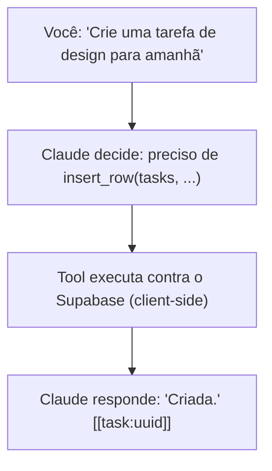

# Khaos — Integração com IA

## Como funciona

A IA conversa em linguagem natural e age no banco via **tool use** —
ferramentas genéricas de leitura/escrita, não uma ferramenta por entidade.
Um único modelo (Claude) é usado; as integrações antigas com Gemini e
DeepSeek foram descontinuadas junto com o backend FastAPI que as hospedava.

Não existe um backend próprio que execute as tools — elas rodam no mesmo
processo que fez a chamada ao modelo: no navegador para o chat do app
(`src/lib/chat`), ou dentro da Edge Function `telegram-bot` para o Telegram.
Ambos compartilham o mesmo núcleo de código (ver
[Dois front-ends, um cérebro](#dois-front-ends-um-cérebro)).

## Modelo

- Modelo: `claude-sonnet-5` (configurável via `VITE_LLM_MODEL` no app,
  `LLM_MODEL` na Edge Function do Telegram)
- O oversight agent (análise em segundo plano) usa `claude-haiku-4-5` por
  padrão, configurável via `OVERSIGHT_LLM_MODEL`
- Tool use nativo via `@anthropic-ai/sdk`, chamado diretamente do client —
  não há wrapper próprio de protocolo

A chave `ANTHROPIC_API_KEY` nunca chega ao navegador: o SDK do Anthropic é
apontado (`baseURL`) para a Edge Function `anthropic-proxy`, que injeta a
chave do lado do servidor e repassa a chamada para `api.anthropic.com`. Ver
[`anthropic-proxy`](#anthropic-proxy) abaixo.

## Arquivos (app web)

| Arquivo | Responsabilidade |
| --- | --- |
| `src/lib/chat/client.ts` | Cria o client Anthropic apontado para o proxy; reexporta os prompts |
| `src/lib/chat/prompts.ts` | `TONE_INSTRUCTION` (persona) e `SYSTEM_INSTRUCTION` (regras de domínio) — puro texto, sem imports, compartilhado com o bot do Telegram (Deno) |
| `src/lib/chat/agent.ts` | Loop de turno: monta o system prompt (com cache), envia ao modelo, executa tool calls, acumula histórico até 6 rodadas de tool use por turno |
| `src/lib/chat/toolsCore.ts` | Schemas das tools, coerção de argumentos, o executor (`executeTool`) — framework-agnóstico, sem imports de runtime, compartilhado com o Telegram |
| `src/lib/chat/tools.ts` | Injeta o client Supabase (anon key) e `searchSchema` no núcleo acima, para uso no browser |
| `src/lib/chat/schemaSearch.ts` / `schemaSearchCore.ts` | Busca por palavra-chave no schema do banco (tabelas, colunas, enums, RPCs) — power por trás da tool `search_schema` |
| `src/lib/chat/entityRefs.ts` | Extrai/injeta os tokens `[[task:uuid]]` etc. usados para renderizar cards inline |
| `src/lib/chat/history.ts` | Leitura/escrita do histórico de conversa (`chat_history`, compartilhado com o Telegram) |
| `src/lib/chat/chatActivityContext.tsx` | Contexto React para estado de atividade do chat |
| `src/hooks/useChatAgent.ts` | Hook que orquestra `runTurn`, injeta contexto temporal/UI na mensagem do usuário e sincroniza com `chat_history` |

## System prompt

`prompts.ts` define duas seções, montadas em `agent.ts` dentro de
`<system_instructions>` / `<tone_and_behavior>` e marcadas com
`cache_control: ephemeral` para acionar prompt caching (o texto precisa ser
byte-a-byte idêntico entre chamadas — contexto variável como data/hora vai
na mensagem do usuário, não no system prompt).

- **`TONE_INSTRUCTION`** — persona: calma, observadora, concisa; nunca
  reivindica uma ação como concluída sem que a tool correspondente tenha
  tido sucesso; regras de quando elaborar vs. responder em uma palavra;
  regras de abertura de sessão.
- **`SYSTEM_INSTRUCTION`** — regras de domínio: hierarquia
  field→project→section→task, uso de `ilike` para busca por nome, `due` vs.
  `target`, como tratar `task_logs` (foreground/background), o toggle
  "marcado para hoje" (moments `today`/`notToday`), obrigatoriedade do
  parâmetro `reason` ao mudar status/prioridade/due/estimate, e o formato
  dos tokens `[[task:uuid]]` / `[[project:uuid]]` / `[[event:uuid]]` que a
  UI renderiza como cards.

## Tools disponíveis

Ao contrário da versão original do sistema (uma tool por operação de cada
entidade — `create_task`, `update_project` etc.), a IA hoje opera com um
conjunto pequeno e genérico de ferramentas do tipo SQL:

### Leitura

| Tool | Descrição |
| --- | --- |
| `search_schema` | Busca por palavra-chave no schema (tabelas, colunas, enums, RPCs) |
| `query_rows` | `SELECT` genérico — tabela, `select`, `filters` (coluna/operador/valor), `orderBy`, `limit` |
| `list_tasks_marked_for_day` | Deriva quais tarefas estão "marcadas para hoje" (ou outro dia) a partir dos moments `today`/`notToday` — evita reimplementar essa lógica via `query_rows` bruto |

### Escrita

| Tool | Descrição |
| --- | --- |
| `insert_row` | Insere uma linha em qualquer tabela permitida |
| `update_rows` | Atualiza linhas que casam com `filters` |
| `delete_rows` | Remove linhas que casam com `filters` (a IA é instruída a preferir soft delete via `deleted_at` quando a coluna existe) |
| `call_rpc` | Chama qualquer função RPC exposta pelo Supabase (ex: `stop_active_task`, `stop_task_log`) |

### Oversight

| Tool | Descrição |
| --- | --- |
| `recall_oversight_notes` | Lê notas geradas em segundo plano pelo oversight agent — padrões notados em lotes de moments, não só no que aconteceu nesta conversa |

Tabelas permitidas (`ALLOWED_TABLES` em `toolsCore.ts`): `fields`, `projects`,
`sections`, `tasks`, `task_items`, `task_logs`, `events`, `routines`,
`moments`, `moment_tags`, `work_tags`, `moment_tag_entities`,
`work_tag_entities`, `sections_sequence`, `tasks_sequence`.

`insert_row`/`update_rows` aceitam um parâmetro opcional `reason` — a
justificativa é anexada como `moment_note` ao moment que o próprio trigger
do banco já criou para essa mudança (`authored_by: 'assistant'`), fechando o
requisito de sempre documentar o contexto de uma mudança de status,
prioridade, due ou estimate.

`toolsCore.ts` também normaliza uma boa quantidade de variações que o
modelo emite na prática: nomes de tool alternativos (`update_row` →
`update_rows`), `filters`/`values` chegando como string JSON em vez de
array/objeto, `filters` chegando como mapa `{coluna: valor}` em vez de lista
de `{column, operator, value}`, `limit`/`ascending` como string.

## Adicionando uma nova tool

1. Adicione o schema em `READ_TOOL_DEFINITIONS`, `WRITE_TOOL_DEFINITIONS` ou
   `OVERSIGHT_TOOL_DEFINITIONS` em `toolsCore.ts`
2. Adicione o `case` correspondente em `executeTool`
3. Se a tool precisa ser usada pelo bot do Telegram também, nada extra é
   necessário — `toolsCore.ts` é compartilhado

## Dois front-ends, um cérebro

`src/lib/chat/*` (persona, schemas de tool, executor) é importado tanto pelo
app web quanto pela Edge Function `telegram-bot`
(`supabase/functions/_shared`), então os dois nunca divergem de
comportamento. O que muda entre eles:

| | App web | Telegram bot |
| --- | --- | --- |
| Chamada ao Claude | via Edge Function `anthropic-proxy` | direta, com `ANTHROPIC_API_KEY` |
| Client Supabase | anon key | service-role key |
| Confirmação de escrita | interativa na UI | nenhuma (bot single-owner atrás de allowlist) |
| Histórico | `chat_history` (compartilhado com o Telegram) | mesmo `chat_history` |

## Edge Functions

### `anthropic-proxy`

Reverse proxy que injeta `ANTHROPIC_API_KEY` do lado do servidor e repassa a
chamada para `api.anthropic.com`. `verify_jwt` fica desligado
(`supabase/config.toml`) porque o gateway bloquearia o preflight CORS antes
de a função rodar; em vez disso, a própria função valida
`Authorization: Bearer <supabase anon/publishable key>` manualmente.

### `telegram-bot`

Webhook do Telegram — responde mensagens com o mesmo agente/persona/tools do
app web. Client Supabase com service-role key, sem passo de confirmação de
escrita (allowlist de chat ids via `TELEGRAM_ALLOWED_CHAT_IDS`). Comandos:
`/start`, `/clear`, `/reset` (limpam o histórico), `/whoami` (retorna o chat
id, usado para configurar o allowlist inicialmente).

### `telegram-notify`

Disparada por cron (ou por um passo do CI de release), envia:

- **`digest`** — resumo matinal (atrasadas, vencem hoje, agenda do dia,
  janelas `scheduled` que passaram sem conclusão, `target` vencido,
  importantes não agendadas). Sugestões de ação ficam pendentes até o
  usuário responder aprovando.
- **`reminders`** — lembrete determinístico (sem chamada ao modelo) alguns
  minutos antes de um evento `scheduled` começar
  (`REMINDER_LEAD_MINUTES`, default 10).
- **`deploy`** — notifica "Deployed vX.Y.Z", disparado pelo workflow de CI
  após um release chegar ao ar na Vercel.

Idempotente via `telegram_notifications`.

### `oversight-agent`

Rodando em cron (ex: a cada 15 min), varre `moments` desde o último cursor
salvo em `oversight_cursor`, agrupa em lotes por entidade e — quando um lote
é "digno de nota" (mais de um moment relacionado, ou um moment de tipo
`note`/`priority`/`status` sozinho) — pede a um modelo mais barato
(`claude-haiku-4-5` por padrão) um resumo curto, salvo em `oversight_notes`.
Só leitura para o chat interativo, via `recall_oversight_notes`; não existe
UI dedicada para essas notas.
